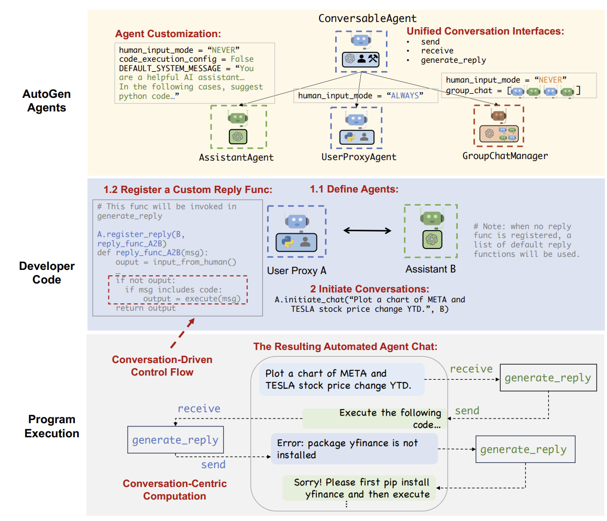

# 논문 리뷰: _AutoGen:Enabling Next-Gen LLM Appkitcations via Multi-Agent Conversations_

**링크**: [arXiv:2308.08155](https://arxiv.org/pdf/2308.08155)
**GitHub**: [github.com/microsoft/autogen](https://github.com/microsoft/autogen)

---

## 1) 연구 배경

기존 LLM은 매우 발전되었지만:

- 복잡한 문제를 해결할 때 내부 추론 과정을 추적하거나 제어하기 어려움
- 사용자 요구에 따라 **모듈화**, **역할 분리**. **self-reflection**이 불가능

> AutoGen은 이를 해결하기 위해, LLM을 **대화 가능한 역할 기반 에이전트**로 구성하고, 다중 에이전트 협업 구조를 제안한다.

---

## 2) 핵심 기여(contributions)

- **Conversable Agent API** 설계  
   → 누구나 쉽게 역할별 에이전트를 정의하고 조합 가능
- **LLM 기반 멀티에이전트 협업 프레임워크**  
   → 코드 생성, 디버깅, 논문 요약, 질문 응답 등 다양한 작업 지원
- **유연한 확장성 및 조합성**  
  → LLM, Tool, Human까지 다양한 에이전트를 조합 가능
- **실제 GitHub 오픈소스 제공**  
   → [https://github.com/microsoft/autogen](https://github.com/microsoft/autogen)

---

## 3) AutoGen 아키텍처 핵심 구조

AutoGen은 **Conversable Agent**라는 개념을 중심으로 돌아감

### 주요 구성요소

| 역할                 | 설명                                        |
| -------------------- | ------------------------------------------- |
| **User Proxy Agent** | 사용자의 요청을 에이전트 시스템에 전달      |
| **Planner Agent**    | 작업을 하위 문제로 나누고, Solver에게 분배  |
| **Solver Agent**     | 실제 작업 (코딩, 문서 생성, 요약 등)을 수행 |
| **Critic Agent**     | Solver의 결과를 평가하고 피드백 제공        |
| **Executor Agent**   | 시스템 명령 실행 또는 툴 호출               |

### 대화 흐름

1. 사용자 요청 → User Agent
2. Planner가 작업을 분해하고 Solver 호출
3. Solver 결과 → Critic 평가 → 수정 반복
4. 최종 응답 전달

### Conversation Programming 개념

AutoGen은 **대화 기반 프로그래밍**채택

- **Conversation-Centric Computation**  
  → 에이전트들이 대화를 통해 응답을 계산
- **Conversation-Driven Control Flow**  
  → 대화 흐름에 따라 어떤 에이전트가 참여할지, 어떤 계산을 할지 결정

즉, AutoGen은 **대화를 코드 실행의 기본 단위**로 본다.

아래 그림은 아키텍처 구조와 대화 기반 실행 과정을 시각적으로 보여줌

---

## 4) 실험 및 사례

### 실험 시나리오

| 시나리오          | 구성                     | 설명                                         |
| ----------------- | ------------------------ | -------------------------------------------- |
| 코드 생성 및 수정 | Planner + Coder + Critic | GPT-4 기반 Solver가 코드 생성, Critic이 검토 |
| 논문 요약         | Summarizer + Critic      | 긴 문서를 여러 단계로 요약 및 검토           |
| 질문응답          | QnA Agent                | 문서 기반 질문에 답변 생성                   |

### 주요 결과

- Critic 포함 시, 정답률과 정확도 크게 향상됨
- GPT-4 외 다른 LLM 및 OpenAI function API와도 연동 성공
- 대화형 구조로 인해 **성능 + 추론 투명성** 확보

---

## 5) 응용 프로그램 예시

논문에서 제시된 대표 응용 사례:

1. **수학 문제 해결**: LLM 기반 수학 문제 풀이, 인간 피드백 반영
2. **검색 보강 QA & 코드 생성**: 외부 문서 기반 QA, 코드 실행 보강
3. **의사 결정 지원**: 텍스트 기반 의사결정 시뮬레이션
4. **다중 에이전트 코딩**: 코드 작성, 검증, 실행을 분리된 에이전트가 수행
5. **동적 그룹 채팅**: 여러 에이전트가 협력하여 문제 해결
6. **대화형 체스**: 자연어 기반 체스 게임 (AI vs Human)

## 6) 해석 및 한계

### 해석

- 에이전트 협업으로 **복잡한 작업 분해 및 조율**
- '프롬프트 엔지니어링'의 부담 담소
- 코드, 분석, 요약, QA 등 **다양한 응용 가능**

### 한계

- 대화형 방식으로 **속도 느림(latency)**
- LLM 기반 평가(Critic)의 **신뢰성 문제**
- 에이전트 수 증가시 **비용 증가**

---

## 7) 향후 과제

- Critic의 판단 신뢰도 향상을 위한 새로운 메커니즘 연구
- 메모리 기반 에이전트로의 확장
- 실시간 툴 연동을 통한 **실용성 강화**
- 안정적인 **제어 메커니즘 및 예외 처리** 연구

---

## 8) 총평

AutoGen은 단일 LLM의 한계를 넘어, **여러 에이전트를 대화형으로 연결해 협업하는 새로운 프레임워크**를 제안
이는 LLM을 단순 질의응답 도구가 아닌, 소프트웨어적 에이전트 시스템으로 발전시키는 핵심 아이디어
